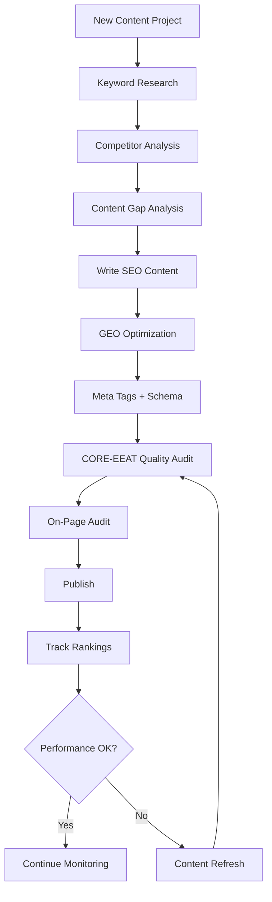

# SEO & GEO Skills Library

[](https://skills.sh/aaron-he-zhu/seo-geo-claude-skills)
[](./LICENSE)
[](./VERSIONS.md)

Claude Skills and Commands for Search Engine Optimization (SEO) and Generative Engine Optimization (GEO). 20 skills, 9 commands, tool-agnostic, works with or without integrations. Content quality powered by the [CORE-EEAT Content Benchmark](https://github.com/aaron-he-zhu/core-eeat-content-benchmark). Domain authority powered by the [CITE Domain Rating](https://github.com/aaron-he-zhu/cite-domain-rating).

> **SEO** gets you ranked in search results. **GEO** gets you cited by AI systems (ChatGPT, Perplexity, Google AI Overviews). This library covers both.

## Quick Start

> Works with [Claude Code](https://claude.ai/download), [Cursor](https://cursor.com), [Codex](https://openai.com/codex), and [35+ other agents](https://skills.sh). No other dependencies.

1. **Install** — choose your method:

   **Skills CLI** (recommended — works with [35+ agents](https://skills.sh)):
   ```bash
   npx skills add aaron-he-zhu/seo-geo-claude-skills
   ```

   Or install a single skill:
   ```bash
   npx skills add aaron-he-zhu/seo-geo-claude-skills -s keyword-research
   ```

   <details>
   <summary>Claude Code Plugin</summary>

   Install directly as a Claude Code plugin:

   ```bash
   # From the Claude Code plugin marketplace
   /plugin marketplace add aaron-he-zhu/seo-geo-claude-skills

   # Or load locally
   claude --plugin-dir ./seo-geo-claude-skills
   ```

   Includes `marketplace.json`, `plugin.json`, and pre-configured MCP servers. See [CONNECTORS.md](./CONNECTORS.md) for MCP setup.

   </details>

   <details>
   <summary>Git Submodule (version-pinned)</summary>

   Add as a submodule for version-pinned updates within an existing project:

   ```bash
   git submodule add https://github.com/aaron-he-zhu/seo-geo-claude-skills.git .claude/skills/seo-geo
   ```

   Update to the latest version:
   ```bash
   git submodule update --remote .claude/skills/seo-geo
   ```

   </details>

   <details>
   <summary>Fork & Customize</summary>

   For teams wanting custom modifications:

   1. Fork this repository on GitHub
   2. Clone your fork:
      ```bash
      git clone https://github.com/YOUR-ORG/seo-geo-claude-skills.git
      ```
   3. Customize skills, add internal connectors, or adjust scoring weights
   4. Install from your fork:
      ```bash
      npx skills add YOUR-ORG/seo-geo-claude-skills
      ```
   5. Pull upstream updates:
      ```bash
      git remote add upstream https://github.com/aaron-he-zhu/seo-geo-claude-skills.git
      git fetch upstream && git merge upstream/main
      ```

   </details>

   <details>
   <summary>Manual install (without CLI)</summary>

   ```bash
   git clone https://github.com/aaron-he-zhu/seo-geo-claude-skills.git
   mkdir -p ~/.claude/skills/ && cp -r seo-geo-claude-skills/* ~/.claude/skills/
   ```

   </details>

2. **Use immediately** — no tool integrations required:
   ```
   Research keywords for [your topic] and identify high-value opportunities
   ```

3. **Run a command** for a one-shot task:
   ```
   /seo:audit-page https://example.com/your-page
   ```

4. **Optionally connect tools** — edit [CONNECTORS.md](./CONNECTORS.md) to map `~~placeholders` to your toolstack (Ahrefs, SEMrush, Google Analytics, etc.)

### Where to Begin

| Your Goal | Start Here | Then |
|-----------|-----------|------|
| Starting from scratch | `keyword-research` → `competitor-analysis` | → `seo-content-writer` |
| Write new content | `keyword-research` | → `seo-content-writer` + `geo-content-optimizer` |
| Improve existing content | `/seo:audit-page <URL>` | → `content-refresher` or `seo-content-writer` |
| Fix technical issues | `/seo:check-technical <URL>` | → `technical-seo-checker` |
| Assess domain authority | `/seo:audit-domain <domain>` | → `backlink-analyzer` |
| Full quality assessment | `content-quality-auditor` + `domain-authority-auditor` | → 120-item combined report |
| Build entity/brand presence | `entity-optimizer` | → `schema-markup-generator` + `geo-content-optimizer` |
| Generate performance report | `/seo:report <domain> <period>` | → periodic monitoring |

## Methodology

Skills are organized into four phases. Use them in order for new projects, or jump to any phase as needed.

```
 RESEARCH          BUILD            OPTIMIZE          MONITOR
 ─────────         ─────────        ─────────         ─────────
 Keywords          Content          On-Page           Rankings
 Competitors       Meta Tags        Technical         Backlinks
 SERP              Schema           Links             Performance
 Gaps              GEO              Refresh           Alerts

 CROSS-CUTTING ──────────────────────────────────────────────────
 Content Quality (CORE-EEAT) · Domain Authority (CITE) · Entity · Memory
```

## Skills

<!-- SKILLS:START -->
### Research — understand your market before creating content

| Skill | What it does |
|-------|-------------|
| [keyword-research](./research/keyword-research/) | Discover keywords with intent analysis, difficulty scoring, and topic clustering |
| [competitor-analysis](./research/competitor-analysis/) | Analyze competitor SEO/GEO strategies and find their weaknesses |
| [serp-analysis](./research/serp-analysis/) | Analyze search results and AI answer patterns for target queries |
| [content-gap-analysis](./research/content-gap-analysis/) | Find content opportunities your competitors cover but you don't |

### Build — create content optimized for search and AI

| Skill | What it does |
|-------|-------------|
| [seo-content-writer](./build/seo-content-writer/) | Write search-optimized content with proper structure and keyword placement |
| [geo-content-optimizer](./build/geo-content-optimizer/) | Make content quotable and citable by AI systems |
| [meta-tags-optimizer](./build/meta-tags-optimizer/) | Create compelling titles, descriptions, and Open Graph tags |
| [schema-markup-generator](./build/schema-markup-generator/) | Generate JSON-LD structured data for rich results |

### Optimize — improve existing content and technical health

| Skill | What it does |
|-------|-------------|
| [on-page-seo-auditor](./optimize/on-page-seo-auditor/) | Audit on-page elements with a scored report and fix recommendations |
| [technical-seo-checker](./optimize/technical-seo-checker/) | Check crawlability, indexing, Core Web Vitals, and site architecture |
| [internal-linking-optimizer](./optimize/internal-linking-optimizer/) | Optimize internal link structure for better crawling and authority flow |
| [content-refresher](./optimize/content-refresher/) | Update outdated content to recover or improve rankings |

### Monitor — track performance and catch issues early

| Skill | What it does |
|-------|-------------|
| [rank-tracker](./monitor/rank-tracker/) | Track keyword positions over time in both SERP and AI responses |
| [backlink-analyzer](./monitor/backlink-analyzer/) | Analyze backlink profile, find opportunities, detect toxic links |
| [performance-reporter](./monitor/performance-reporter/) | Generate SEO/GEO performance reports for stakeholders |
| [alert-manager](./monitor/alert-manager/) | Set up alerts for ranking drops, traffic changes, and technical issues |

### Cross-cutting — span all phases

| Skill | What it does |
|-------|-------------|
| [content-quality-auditor](./cross-cutting/content-quality-auditor/) | Full 80-item CORE-EEAT content quality audit with weighted scoring |
| [domain-authority-auditor](./cross-cutting/domain-authority-auditor/) | Full 40-item CITE domain authority audit with veto checks and domain-type weighting |
| [entity-optimizer](./cross-cutting/entity-optimizer/) | Audit and build entity presence across Knowledge Graph, Wikidata, and AI systems |
| [memory-management](./cross-cutting/memory-management/) | Two-layer project memory (hot cache + cold storage) for context across sessions |
<!-- SKILLS:END -->

## Commands

One-shot tasks with explicit input and structured output.

| Command | Description |
|---------|-------------|
| `/seo:audit-page <URL>` | Full on-page SEO + CORE-EEAT content quality audit with scored report |
| `/seo:check-technical <URL>` | Technical SEO health check (crawlability, speed, security) |
| `/seo:generate-schema <type>` | Generate JSON-LD structured data markup |
| `/seo:optimize-meta <URL>` | Optimize title, description, and OG tags |
| `/seo:report <domain> <period>` | Comprehensive SEO/GEO performance report |
| `/seo:audit-domain <domain>` | Full CITE domain authority audit with 40-item scoring and veto checks |
| `/seo:write-content <topic>` | Write SEO + GEO optimized content from a topic and target keyword |
| `/seo:keyword-research <seed>` | Research and analyze keywords for a topic or niche |
| `/seo:setup-alert <metric>` | Configure monitoring alerts for critical metrics |

Command files: [commands/](./commands/)

## Recommended Workflow



**Skill combos that work well together:**

- **keyword-research** + **content-gap-analysis** → comprehensive content strategy
- **seo-content-writer** + **geo-content-optimizer** → dual-optimized content
- **on-page-seo-auditor** + **technical-seo-checker** → complete site audit
- **rank-tracker** + **alert-manager** → proactive monitoring
- **content-quality-auditor** + **content-refresher** → data-driven content refresh
- **content-quality-auditor** + **domain-authority-auditor** → complete 120-item assessment
- **domain-authority-auditor** + **backlink-analyzer** → domain authority deep-dive
- **entity-optimizer** + **schema-markup-generator** → complete entity markup
- **memory-management** + any skill → persistent project context

## Inter-Skill Handoff Protocol

When skills recommend running another skill (via Related Skills), preserve this context for the next skill:

| Context | How to Pass | Example |
|---------|------------|---------|
| Target keyword | Include in the skill invocation | "Run content-refresher for keyword 'cloud hosting'" |
| Content type | State explicitly | "Content type: how-to guide" |
| CORE-EEAT scores | Summarize dimension scores | "Current scores: C:75 O:60 R:80 E:45 — focus on Exclusivity" |
| CITE scores | Summarize dimension + veto status | "CITE: C:82 I:65 T:71 E:58, no veto triggers" |
| Priority items | List specific item IDs | "Priority: improve O08, E07, R06" |
| Content URL | Include for fetch-capable skills | "Analyze https://example.com/page" |

**Memory-managed handoff**: If `memory-management` is active, prior audit results are automatically available via the hot cache in `CLAUDE.md`. Skills should check for cached scores before re-running audits.

## Reference Materials

Shared references used by multiple skills:

| Reference | Items | Used by |
|-----------|:-----:|---------|
| [core-eeat-benchmark.md](./references/core-eeat-benchmark.md) | 80 | content-quality-auditor, seo-content-writer, geo-content-optimizer, content-refresher, on-page-seo-auditor |
| [cite-domain-rating.md](./references/cite-domain-rating.md) | 40 | domain-authority-auditor, backlink-analyzer, competitor-analysis, performance-reporter |

Most skills also include `references/` subdirectories with skill-specific templates, rubrics, and checklists (e.g. http-status-codes, robots-txt, kpi-definitions, report-templates).

## Finding the Right Skill

Not sure which skill to use? Search by what you're trying to do:

| You're looking for... | Use this skill |
|----------------------|---------------|
| Find keywords / topic ideas / what to write about | [keyword-research](./research/keyword-research/) |
| Search volume / long-tail keywords / ranking opportunities | [keyword-research](./research/keyword-research/) |
| Analyze competitors / competitive intelligence / who ranks for X | [competitor-analysis](./research/competitor-analysis/) |
| Competitor keywords / competitor backlinks / benchmarking | [competitor-analysis](./research/competitor-analysis/) |
| SERP analysis / what ranks for X / featured snippets | [serp-analysis](./research/serp-analysis/) |
| AI overviews / SERP features / why does this page rank | [serp-analysis](./research/serp-analysis/) |
| Content gaps / what am I missing / untapped topics | [content-gap-analysis](./research/content-gap-analysis/) |
| Competitor content analysis / content opportunities / content strategy gaps | [content-gap-analysis](./research/content-gap-analysis/) |
| Write a blog post / article writing / content creation | [seo-content-writer](./build/seo-content-writer/) |
| SEO copywriting / draft optimized content / write for SEO | [seo-content-writer](./build/seo-content-writer/) |
| Optimize for AI / get cited by ChatGPT / AI optimization | [geo-content-optimizer](./build/geo-content-optimizer/) |
| GEO optimization / appear in AI answers / LLM citations | [geo-content-optimizer](./build/geo-content-optimizer/) |
| Title tag / meta description / improve CTR | [meta-tags-optimizer](./build/meta-tags-optimizer/) |
| Open Graph / Twitter cards / social media preview | [meta-tags-optimizer](./build/meta-tags-optimizer/) |
| Schema markup / structured data / JSON-LD / rich snippets | [schema-markup-generator](./build/schema-markup-generator/) |
| FAQ schema / How-To schema / product markup | [schema-markup-generator](./build/schema-markup-generator/) |
| On-page SEO audit / SEO score / page optimization | [on-page-seo-auditor](./optimize/on-page-seo-auditor/) |
| Header tags / image optimization / check my page | [on-page-seo-auditor](./optimize/on-page-seo-auditor/) |
| Technical SEO / page speed / Core Web Vitals | [technical-seo-checker](./optimize/technical-seo-checker/) |
| Crawl issues / indexing problems / mobile-friendly check | [technical-seo-checker](./optimize/technical-seo-checker/) |
| Internal links / site architecture / link structure | [internal-linking-optimizer](./optimize/internal-linking-optimizer/) |
| Page authority distribution / content silos / site navigation | [internal-linking-optimizer](./optimize/internal-linking-optimizer/) |
| Update old content / refresh content / content decay | [content-refresher](./optimize/content-refresher/) |
| Declining rankings / revive old blog posts / outdated content | [content-refresher](./optimize/content-refresher/) |
| Track rankings / keyword positions / how am I ranking | [rank-tracker](./monitor/rank-tracker/) |
| SERP monitoring / ranking trends / position tracking | [rank-tracker](./monitor/rank-tracker/) |
| Analyze backlinks / link profile / toxic links | [backlink-analyzer](./monitor/backlink-analyzer/) |
| Link building / off-page SEO / link authority | [backlink-analyzer](./monitor/backlink-analyzer/) |
| SEO report / performance report / traffic report | [performance-reporter](./monitor/performance-reporter/) |
| SEO dashboard / report to stakeholders / monthly report | [performance-reporter](./monitor/performance-reporter/) |
| SEO alerts / monitor rankings / ranking notifications | [alert-manager](./monitor/alert-manager/) |
| Traffic alerts / watch competitor changes / alert me | [alert-manager](./monitor/alert-manager/) |
| Content quality audit / EEAT score / how good is my content | [content-quality-auditor](./cross-cutting/content-quality-auditor/) |
| CORE-EEAT audit / content assessment / quality score | [content-quality-auditor](./cross-cutting/content-quality-auditor/) |
| Domain authority audit / domain trust / site credibility | [domain-authority-auditor](./cross-cutting/domain-authority-auditor/) |
| CITE audit / domain rating / how authoritative is my site | [domain-authority-auditor](./cross-cutting/domain-authority-auditor/) |
| Entity optimization / knowledge graph / knowledge panel | [entity-optimizer](./cross-cutting/entity-optimizer/) |
| Brand entity / entity disambiguation / Wikidata | [entity-optimizer](./cross-cutting/entity-optimizer/) |
| Remember project context / save SEO data / track campaign | [memory-management](./cross-cutting/memory-management/) |
| Store keyword data / save progress / project memory | [memory-management](./cross-cutting/memory-management/) |

## All Installation Methods

| Method | Command | Best for |
|--------|---------|----------|
| **Skills CLI** | `npx skills add aaron-he-zhu/seo-geo-claude-skills` | Most users, 35+ agents |
| **Claude Code Plugin** | `/plugin marketplace add aaron-he-zhu/seo-geo-claude-skills` | Claude Code plugin system |
| **Git Submodule** | `git submodule add ... .claude/skills/seo-geo` | Version-pinned team installs |
| **Fork & Customize** | Fork + `npx skills add YOUR-ORG/...` | Teams with custom needs |
| **Manual** | `git clone` + copy | No CLI needed |

Browse all 20 skills: [skills.sh/aaron-he-zhu/seo-geo-claude-skills](https://skills.sh/aaron-he-zhu/seo-geo-claude-skills)

```bash
# Install all skills
npx skills add aaron-he-zhu/seo-geo-claude-skills

# Install a specific skill
npx skills add aaron-he-zhu/seo-geo-claude-skills -s keyword-research

# Preview available skills
npx skills add aaron-he-zhu/seo-geo-claude-skills --list

# Install globally for all agents
npx skills add aaron-he-zhu/seo-geo-claude-skills -g -y --all
```

## Contributing

See [CONTRIBUTING.md](./CONTRIBUTING.md) for how to add new skills, improve existing ones, or request features.

## Related Repositories

| Repository | What it provides |
|------------|-----------------|
| [CORE-EEAT Content Benchmark](https://github.com/aaron-he-zhu/core-eeat-content-benchmark) | 80-item content quality scoring framework |
| [CITE Domain Rating](https://github.com/aaron-he-zhu/cite-domain-rating) | 40-item domain authority scoring framework |

## License

Apache License 2.0
